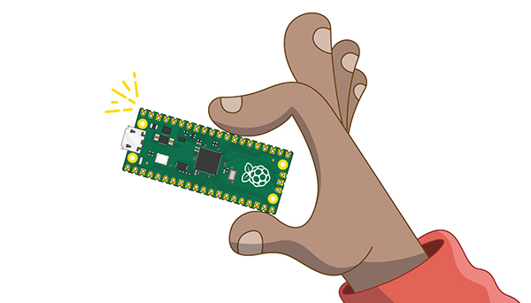

## سوف تصنع

في هذا المشروع ، ستستخدم Raspberry Pi Pico لصنع يراعة LED تومض بنمط معين ، تمامًا مثل اليراعات في الطبيعة ، وتوصيل مفتاح للتحكم في الضوء.

[[[flashing-light-warning]]]

المتحكم الدقيق microcontroller هو جهاز حوسبة صغير يمكنه تشغيل التعليمات البرمجية والتفاعل مع المكونات الإلكترونية (مثل الأزرار والأضواء). عادة ما يتم تصميمه لإكمال مهمة واحدة ، ولا يحتوي على نظام تشغيل. 
Raspberry Pi Pico هو متحكم دقيق منخفض التكلفة يمكن استخدامه من قبل المبتدئين ويمكن استخدامه أيضا من قبل الخبراء لتطوير المنتجات الإلكترونية.

{:width="300px"}

 
سوف تقوم بمايلي:

+ تعرف على "المتحكم الدقيق" Raspberry Pi Pico **microcontroller**
+ قم بتوصيل LED ومفتاح مصنوع من أسلاك التوصيل إلى المنافذ الموجودة في **Raspberry Pi Pico**
+ قم ببرمجة Raspberry Pi Pico باستخدام **MicroPython** و Thonny

--- no-print ---

--- task ---

يوضح هذا المثال وميض LED لتقليد يراعة حقيقية! هل يمكنك تحديد النمط المتكرر في الومضات؟

{:width="300px"}

--- /task ---

--- /no-print ---

--- print-only ---

--- task ---

يوضح هذا المثال يراعة LED. سوف يومض LED الخاص بك لتقليد اليراعة الحقيقية!

--- /task ---

--- /print-only ---

لإتمام هذا المشروع ، ستحتاج إلى:

**الأجهزة**

يمكنك شراء كافة الأجهزة المطلوبة لهذا المشروع والمشاريع الأخرى في هذا المسار من متجر [Pimoroni web store.](https://shop.pimoroni.com/products/pico-intro-kit?variant=39893512945747){:target='_blank'}

+ Raspberry Pi Pico مع رؤوس توصيل ملحومة عليه
+ كابل **data** USB A الى micro USB
+ 1× LED أصفر (أو أي لون تفضله)
+ 1× 100Ω مقاومة (أي مقاومة من 75Ω إلى 220Ω سوف تعمل)
+ 1 × سلك توصيل دبوس - مقبس
+ 3 × سلك توصيل مقبس - مقبس
+ اختياري: شريط لاصق، الشريط غير المرئي يعمل بشكل أفضل

[[[pin-socket-jumper-wires]]]

**البرمجيات**

+ Thonny - يمكن إكمال هذا المشروع باستخدام محرر Thonny Python، والذي يمكن تثبيته على أنظمة Linux, Windows أو Mac

[[[thonny-install]]]

[[[change-theme-thonny]]]

