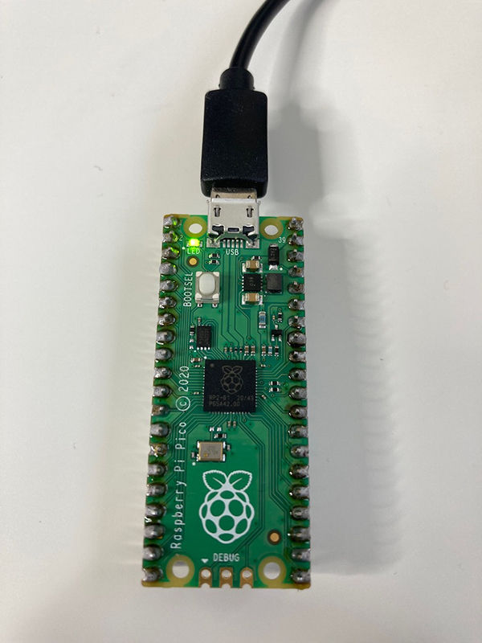

## إشعال مصباح LED الخاص ب Raspberry Pi Pico

في هذه الخطوة، ستقوم بإشعال مصباح LED الصغير الموجود بالجزء العلوي من Raspberry Pi Pico. سيؤدي ذلك إلى التحقق أنه تم إعداد Raspberry Pi Pico بشكل صحيح.

 {:width="300px"}

 LED  يرمز إلى الصمام الثنائي الباعث للضوء ( light-emitting diode). يستخدم التلألؤ الكهربائي ، يعني أن المادة تضيء عند مرور تيار كهربائي من خلالها. يتوفر مصباح LED على ساقين - واحدة طويلة وأخرى قصيرة - ويجب توصيله بالطريقة الصحيحة. الساق الطويلة موجبة (+) والساق القصيرة سالبة (-). هناك طريقة أخرى للتحقق مما إذا كانت الساق موجبة أو سالبة وهي استخدام إصبعك للعثور على الجانب المسطح من مصباح LED. يوجد الجانب المسطح على نفس جهة الساق السالبة.

--- task ---

انظر إلى Raspberry Pi Pico الخاص بك وأعثر على LED الصغير الموجود بجوار منفذ USB.

{:width="200px"}

--- /task ---

--- task ---

قم بإنشاء ملف جديد في Thonny بالنقر فوق **File** > **New** في شريط القوائم العلوي. سيتم فتح حيز عمل فارغ.

--- /task ---

في الخطوة الأخيرة، قمت بتثبيت مكتبة `picozero`. تتيح لك هذه المكتبة برمجة المكونات الإلكترونية المرفقة ب Raspberry Pi Pico. في الجزء العلوي من نص التعليمات البرمجية الخاصة بك ، ستحتاج إلى استيراد العناصر التي تحتاجها من مكتبة `picozero`.

--- task ---

أكتب نص التعليمات البرمجية التالي في لوحة التحرير الرئيسية لبرنامج Thonny:

--- code ---
---
language: python filename: line_numbers: true line_number_start:
line_highlights:
---
from picozero import pico_led

pico_led.on()

--- /code ---

--- /task ---

--- task ---

اختر **File**->**Save As**. سيسألك برنامج Thonny عما إذا كنت تريد حفظ الملف **على هذا الكمبيوتر This computer** أو **Raspberry Pico **. اختر **هذا الكمبيوتر This computer** لحفظ التعليمات البرمجية على جهاز الحاسوب الخاص بك.

اختر موقعا على جهاز الحاسوب الخاص بك مثل مجلد "المستندات Documents". قم بتسمية الملف `firefly.py`.

--- /task ---

--- task ---

**اختبار:** يحتوي برنامج Thonny على زر تشغيل أخضر بداخله مثلث أبيض صغير. يتيح لك الضغط على هذا الزر تشغيل التعليمات البرمجية الخاصة بك.

+ إضغط على زر التشغيل

+ تحقق أن LED الصغير على Raspberry Pi Pico قد إشتعل

{:width="300px"}

--- /task ---

--- task ---

**تصحيح:**

--- collapse ---
---
title: زر التشغيل منطفئ (باهت)
---

إذا كنت لا ترى زر تشغيل أخضر (باهت):
+ انقر على الزر الأحمر **إيقاف**
+ تحقق من توصيل Raspberry Pi Pico بالحاسوب باستخدام كبل USB
+ انقر على **MicroPython (Raspberry Pi Pico)** في الزاوية السفلية اليمنى من برنامج Thonny لإعادة الاتصال
+ إفصل كبل USB ثم أعد توصيله مرة أخرى

--- /collapse ---

--- collapse ---
---
title: يقول برنامج Thonny أن هناك خطأ في التعليمات البرمجية الخاصة بي
---

تحقق من التعليمات البرمجية بعناية فائقة وتأكد من مطابقتها للمثال.

--- /collapse ---

--- collapse ---
---
title: لا توجد أخطاء في التعليمات البرمجية الخاصة بي ولكن الضوء لا يشتعل
---

جرب كبل USB آخرا، وتأكد من أنه كبل USB **بيانات**. كحل أخير ، جرب Raspberry Pi Pico آخر (إذا كانت لديك قطعة إحتياطية).

--- /collapse ---

--- /task ---

سيبقى مؤشر LED مشتعلا حتى تكتب تعليمات برمجية لإطفائه أو تقوم بفصل Raspberry Pi Pico.

--- task ---

قم بإستيراد `sleep` للسماح لك بإيقاف التعليمات البرمجية مؤقتا. أضف التعليمات البرمجية إلى نهاية البرنامج النصي الخاص بك للنوم لمدة ثانية واحدة ثم قم بإيقاف تشغيل مؤشر LED.

--- code ---
---
language: python filename: firefly.py line_numbers: true line_number_start: 1
line_highlights: 2,5-6
---
from picozero import pico_led from time import sleep

pico_led.on() sleep(1) pico_led.off() --- /code ---

--- /task ---

--- task ---

**اختبار:** انقر فوق الزر الأخضر ** play **. سيقوم Thonny بحفظ الملف على Raspberry Pi Pico ثم تشغيل الكود الجديد.

تحقق من أن مؤشر LED يشتغل ثم ينطفئ مرة أخرى. سيضيء مؤشر LED لمدة ثانية واحدة فقط ، لذا تأكد من أنك تشاهدها.

قم بتشغيل التعليمات البرمجية الخاصة بك عدة مرات كما تريد.

{:width="300px"}

**تصحيح:**

--- collapse ---
---
title: يقول Thonny أن sleep isn't defined
---

أضف السطر البرمجي `from time import sleep`.

--- /collapse ---

--- /task ---
