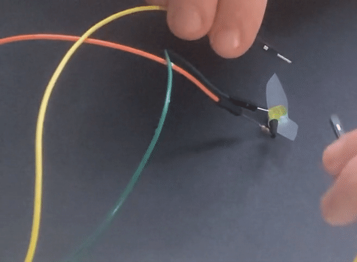

## أضف مفتاحًا كهربائياً

من المفيد أن تكون قادرًا على التحكم عندما يبدأ مصباح LED الخاص بك في الوميض وأن تكون قادرًا على إيقاف تشغيله من الجهاز. 

{:width="300px"}

يمكن لـ Raspberry Pi Pico اكتشاف ما إذا كان الإدخال متصلاً بين **GND** وأحد دبابيس GP.

المفتاح  هو مكون كهربائي يمكن أن يُغلق **للسماح للتيار الكهربائي بالتدفق و** يُفتح **لمنع تدفق التيار الكهربائي. الزر  هو أيضًا نوع من التبديل يقوم بإجراء اتصال عند الضغط عليه**.

إن أبسط نوع من المفاتيح هو سلكان توصيل يمكن توصيلهما معًا لإغلاق المفتاح ، أو فصلهما لفتح المفتاح.

[[[pin-socket-jumper-wires]]]

--- task ---

ابحث عن سلك توصيل ذو دبوس- مقبس وسلك مقبس-مقبس - لا يهم الألوان.

--- /task ---

--- task ---

**اربط** سلك توصيل واحد بـ **GP18** والآخر بـ **GND**. لا يهم أي سلك توصيل يتم توصيله بأي دبوس.

--- /task ---

--- task ---

لإضافة مفاتيح ، تحتاج إلى استيراد `import Switch` من مكتبة `picozero`.

أضف `, Switch` إلى نهاية قائمة الاستيراد في **سطر 1**. بعد ذلك ، اضبط `switch` إلى **GP18**:

--- code ---
---
language: python
filename: firefly.py
line_numbers: true
line_number_start: 1
line_highlights: 1, 9
---
from picozero import pico_led, LED, Switch
from time import sleep

pico_led.on()
sleep(1)
pico_led.off()

firefly = LED(13) # استخدام منفذ GP13
switch = Switch(18) # استخدام منفذ GP18

--- /code ---

--- /task ---

عندما تقوم بتوصيل سلكي التوصيل معًا ، فإن هذا يكمل الدائرة ويسمح لـ Raspberry Pi Pico باكتشاف أن المفتاح مغلق.

--- task ---

أضف كوداً للتحقق من الرقم `إذا كان المفتاح` الخاص بك مغلقًا `(الاسلاك متصلة)` و اضيء اليراعة فقط إذا كان مغلقًا:

--- code ---
---
language: python
filename: firefly.py
line_numbers: true
line_number_start: 9
line_highlights: 12-19
---
switch = Switch(18) # Use GP18

while True:
    if switch.is_closed: # Wires are connected
        firefly.on()
        sleep(0.5) # Stay on for half a second
        firefly.off()
        sleep(2.5) # Stay off for 2.5 seconds
    else: # Wires are not connected
        firefly.off()
        sleep(0.1) # Small delay

--- /code ---

--- /task ---

--- no-print ---

--- task ---

**اختبار:** تأكد من أن أسلاك التوصيل **ليست** متصلة ، ثم قم بتشغيل التعليمات البرمجية الخاصة بك.

--- collapse ---

---
title: ماذا تتوقع أن يحدث عند تشغيل التعليمات البرمجية الخاصة بك؟
---

أسلاك التوصيل **ليست** مغلقة ، لذلك سيتم تشغيل التعليمات البرمجية الموجودة في كتلة `else`. هذا يعني أن مصباح اليراع سيبقى **مغلق**.

--- /collapse ---

الآن قم بتوصيل أسلاك التوصيل معًا. يجب أن تبدأ اليراع في الوميض.

افصل أسلاك التوصيل ويجب أن تتوقف اليراع عن الوميض.

--- /task ---

--- /no-print ---

--- print-only ---

--- task ---

**اختبار:** تأكد من أن أسلاك التوصيل **ليست** متصلة ، ثم قم بتشغيل التعليمات البرمجية الخاصة بك.

--- collapse ---

---
title: ماذا تتوقع أن يحدث عند تشغيل التعليمات البرمجية الخاصة بك؟
---

أسلاك التوصيل **ليست** مغلقة ، لذلك سيتم تشغيل التعليمات البرمجية الموجودة في كتلة `else`. هذا يعني أن مصباح اليراع سيبقى **مغلق**.

--- /collapse ---

الآن قم بتوصيل أسلاك التوصيل معًا.

يجب أن تبدأ اليراع في الوميض.

افصل أسلاك التوصيل ويجب أن تتوقف اليراع عن الوميض.

--- /task ---

--- /print-only ---

**ملحوظة:** لن يؤدي فصل أسلاك التوصيل إلى إيقاف الطاقة عن مصباح اليراع على الفور. يتم إيقاف تشغيل اليراع فقط عند تشغيل التعليمات البرمجية `firefly.off()`.

--- task ---

**اختياري:** إذا كنت في مجموعة ، فيمكنك محاولة مزامنة اليراعات الخاصة بك عن طريق توصيل مفاتيح سلك التوصيل في نفس الوقت.

--- /task ---
