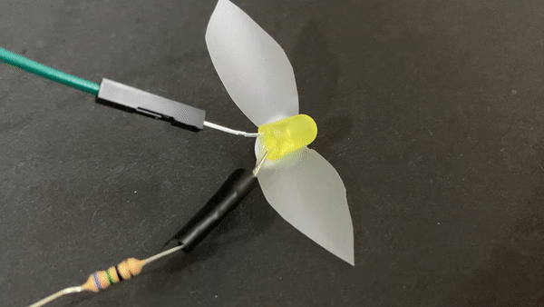

## Introduction

Use a Raspberry Pi Pico to make an LED firefly that flashes in a particular pattern, just like fireflies in nature. Connect a switch to turn it on. 

Warning: **This project uses blinking lights.** A very small percentage of people may experience a seizure when exposed to certain visual images, including flashing lights. Even people who have never had seizures may have a condition they don't know about that can cause these **photosensitive epileptic seizures**.
**If you experience any symptoms or feel unwell: immediately stop working and consult a doctor.**

A microcontroller is a tiny computing device that can run code and interact with electronics components (such as buttons and lights).It is usually designed to complete a single task, and doesn't have an operating system.

You will:

+ Explore a **microcontroller** and use one to make an embedded device
+ Connect electronics components to the **Raspberry Pi Pico**
+ Program the **microcontroller** to interact with electronics components using MicroPython and Thonny

To complete this project you will need:

**Hardware**

+ A Raspberry Pi Pico with pin headers soldered on
+ A **data** USB A to micro USB cable
+ 1 x yellow LED 
+ 1 x 75Ω resistor
+ 1 x pin-socket jumper wire
+ 3 x socket-socket jumper wire
 
+ Optional: Sticky tape, invisible tape works best

You can prepare your LED <mark> make this a link </mark> in advance by attaching it to a resistor and jumper wires before starting the project. 

**Software**

+ Thonny - this project can be completed using the Thonny Python editor which can be installed on a Linux, Windows or Mac computer.

[[[thonny-install]]]

[[[change-theme-thonny]]]

An embedded device often contains a microcontroller and is designed for a specific task. You might have used one in a games controller, microwave oven, mood light, electronic game or toy, pedometer, voice controlled home assistant, medical device or electronic calculator. Can you think of embedded devices that you use?
 

--- no-print ---
--- task ---
  
This example shows an LED blinking to mimic a real firefly! Can you spot the repeating pattern in the flashes? 

{:width="300px"}

--- /task ---
--- /no-print ---

--- print-only ---

--- /print-only ---
