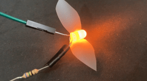

## Introduction

In this project, <mark> short project description </mark>

<mark>Boxout (wherever wanted/needed) </mark>

**Term** description of term or interesting phrase.

<mark>Objectives in language that learners will understand</mark>

You will:
+ 
+ 
+ 

--- no-print ---
--- task ---
### Try it

  
Description of what to do or think about when looking at the example.

  <iframe allowtransparency="true" width="485" height="402" src="https://scratch.mit.edu/projects/embed/485673032/?autostart=false" frameborder="0"></iframe>

--- /task ---
--- /no-print ---

--- print-only ---

--- /print-only ---
