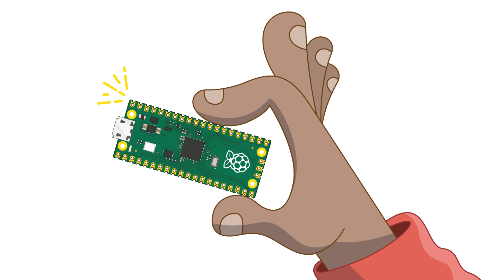

## You will make

In this project, you will use a Raspberry Pi Pico to make an LED firefly that flashes in a particular pattern, just like fireflies in nature, and connect a switch to control the light. 

[[[flashing-light-warning]]]

A microcontroller is a tiny computing device that can run code and interact with  electronics components (such as buttons and lights). It is usually designed to complete a single task, and doesn't have an operating system. 
The Raspberry Pi Pico is a low-cost microcontroller that can be used by beginners and can also be used by experts to develop electronic products.

{:width="300px"}

 
You will:

+ Meet the Raspberry Pi Pico **microcontroller** 
+ Connect an LED and a switch made from jumper wires to the pins on a **Raspberry Pi Pico** 
+ Program the Raspberry Pi Pico using **MicroPython** and Thonny

--- no-print ---

--- task ---
  
This example shows an LED blinking to mimic a real firefly! Can you spot the repeating pattern in the flashes? 

{:width="300px"}

--- /task ---

--- /no-print ---

--- print-only ---

--- task ---

This example shows an LED firefly. Your LED will blink to mimic a real firefly! 

--- /task ---

--- /print-only ---

To complete this project you will need:

**Hardware**

You can purchase all the required hardware for this project and the other projects in this path from the [Kitronik web store.](https://kitronik.co.uk/products/5343-raspberry-pi-foundation-pico-pathway-pack){:target='_blank'}

+ A Raspberry Pi Pico with pin headers soldered on
+ A **data** USB A to micro USB cable
+ 1× yellow LED (or any colour you prefer)
+ 1× 100Ω resistor (any resistor from 75Ω to 220Ω will work)
+ 1× pin–socket jumper wire
+ 3× socket–socket jumper wire
+ Optional: Sticky tape, invisible tape works best

[[[pin-socket-jumper-wires]]]

You can [prepare your LED](https://projects.raspberrypi.org/en/projects/introduction-to-the-pico){:target="_blank"} in advance by attaching it to a resistor and jumper wires before starting the project. 

**Software**

+ Thonny – this project can be completed using the Thonny Python editor, which can be installed on a Linux, Windows, or Mac computer

[[[thonny-install]]]

[[[change-theme-thonny]]]

