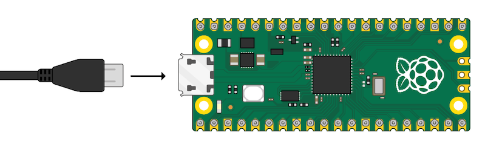
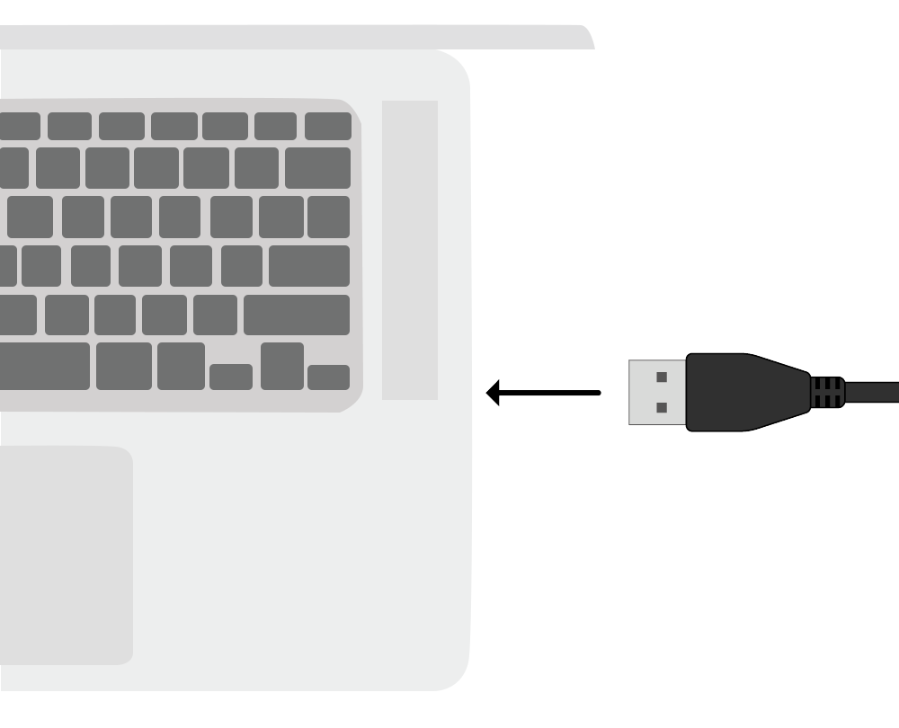
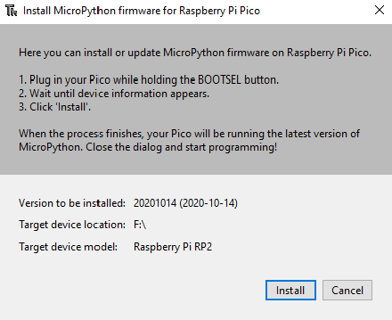
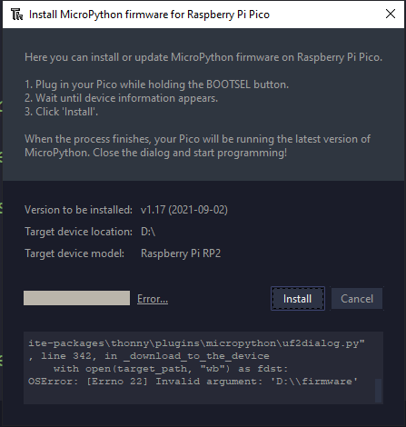

## Set up your Raspberry Pi Pico

Connect your Raspberry Pi Pico and set up MicroPython.

MicroPython is a version of the Python programming language for microcontrollers, like your Raspberry Pi Pico. MicroPython lets you use your Python knowledge to write code to interact with electronics components.

--- task ---

**Connect:** the small end of your USB cable to the Raspberry Pi Pico.

--- /task ---

--- task ---

**Connect:** the other end to your computer, laptop or Raspberry Pi.

--- /task ---

--- task ---

Open the Thonny editor. 

--- /task ---

--- task ---

Look at the text in the bottom right of the Thonny editor. It will show you the version of Python that is being used.

If it does not say 'MicroPython (Raspberry Pi Pico)' then click on the text and select 'MicroPython (Raspberry Pi Pico)'.

If you have never used MicroPython on your Raspberry Pi Pico, then Thonny will prompt you to add the MicroPython firmware. Click install. 

--- /task ---

--- task ---

**Debug:** 

--- collapse ---
---
title: There was an error installing the firmware
---
If you see an error message during install then:
+ disconnect your Raspberry Pi Pico
+ reconnect your Raspberry Pi Pico
+ try installing the firmware again (you might need to press the stop button first)

--- /collapse ---

--- collapse ---

---
title: I don't know if firmware is installed and cannot connect to my Pico
---

Make sure your Raspberry Pi Pico is connected to your computer with a microUSB cable. Click on the list in the bottom right of your Thonny window. A popup menu will appear listing the available interpreters. 

 

If you cannot see the Pico in the list (like in the picture), you will need to reconnect your Raspberry Pi Pico while holding the BOOTSEL button to mount it as a storage volume and reinstall the firmware by following the instructions in the collapse above.

--- /collapse ---

--- collapse ---

---
title: Firmware is installed but I still cannot connect to my Pico
---

You may be using the wrong kind of microUSB cable. Your current microUSB cable may be damaged, or designed only to carry power to devices and cannot transfer data. Try swapping your cable if nothing else has worked. 

If your Pico still won't connect after trying all these things, it may *itself* be damaged and unable to connect. 

--- /collapse ---

You can find further information in the [Raspberry Pi Pico Guide](https://projects.raspberrypi.org/en/projects/introduction-to-the-pico){:target="_blank"}.

--- /task ---

--- task ---

<mark>Add the Pico Zero library. Tools > Manage Plugins > Pico??? to add it in.</mark>

--- /task ---

--- save ---