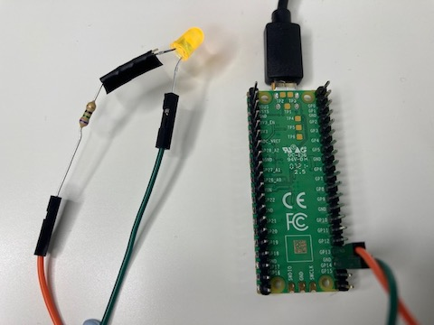
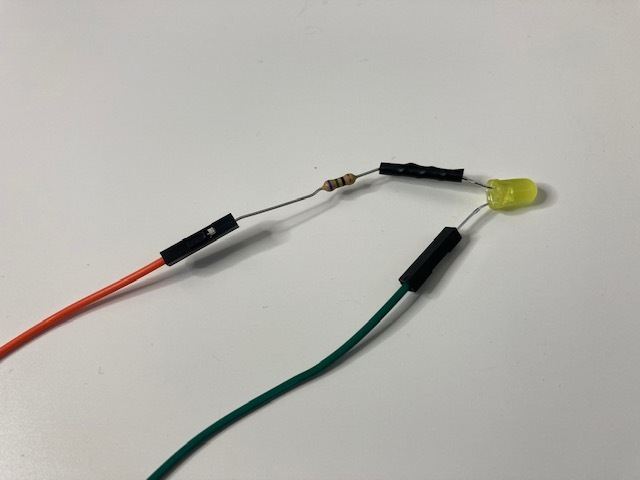
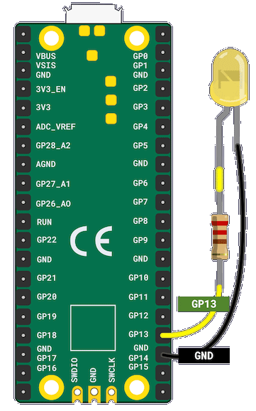
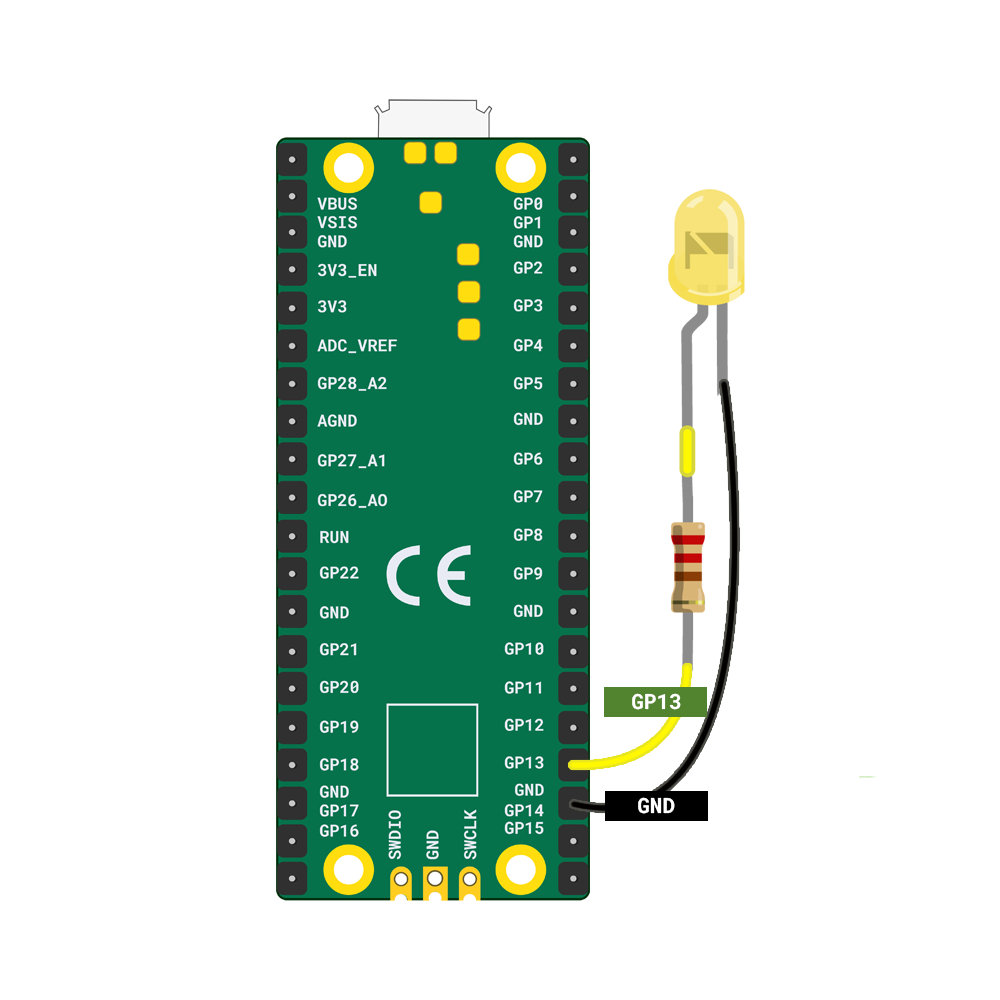
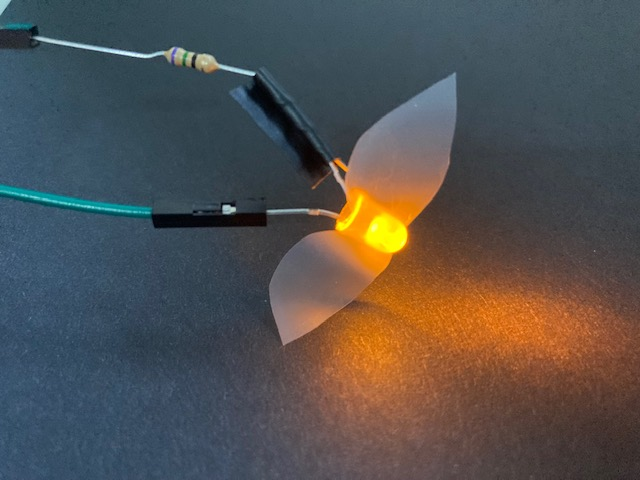

## Light your firefly

Use jumper wires to connect an LED with a resistor to your Raspberry Pi Pico and write code to light it. 

{:width="300px"}

--- task ---

Make sure that you have an LED connected to a resistor and two socket-socket jumper wires. The colour of the jumper wires does not matter, they all do the same thing.  

Fireflies are usually yellow, orange or green but you can choose any colour you like.

A **resistor** controls the current that flows through a circuit. This protects the LED from burning out and will make it last longer.

If your LED does not have jumper wires and a resistor attached then you can add them:

[[[led-resistor-electrical-tape]]]

[[[led-resistor-solder-heat-shrink]]]

--- /task ---

A Raspberry Pi Pico has **40 pins** on its board. **Pins** allow you to connect external components to the Raspberry Pi Pico.  

--- task ---

Explore your Raspberry Pi Pico and find the pin that is labelled **GP13**. You will notice that there are labels for each pin on the **underneath** side of the Raspberry Pi Pico. 

--- /task ---

--- task ---
 
**Connect:** the jumper wire that is attached to the positive leg of the LED (the one with the resistor) to pin **GP13**. Push it until the black plastic meets the base of the header. 

**Connect:** the jumper wire that is attached to the negative leg to the **GND** (ground), below GP13. This completes the circuit, allowing electrical current to flow when instructed by your code.

--- /task ---

--- task ---

In the last step you used `pico_led` to light the LED on the Raspberry Pi Pico. To add your own LEDs you need to `import` `LED` from picozero. 

Add `, LED` to the end of the import list on **line 1**. Next, set your firefly LED to **GP13** and enter the code to switch it on. 

Enter the code to light your firefly: 

--- code ---
---
language: python
filename: firefly.py
line_numbers: true
line_number_start: 1
line_highlights: 1,8-9
---
from picozero import pico_led, LED
from time import sleep

pico_led.on()
sleep(1)
pico_led.off()

firefly = LED(13) # Use GP13
firefly.on()
--- /code ---

**Tip:** To import multiple items, separate them with commas ','.

--- /task ---

--- task ---

**Test:** Run your code to see your LED firefly light up. 

**Debug**:

--- collapse ---
---
title: My code isn't running
---

If your code isn't running:
+ Fix any errors in your code. The LED on the Raspberry Pi Pico will flash if your code runs successfully.

--- /collapse ---

--- collapse ---
---
title: My LED firefly doesn't light up
---

If your LED firefly does not light up:
+ Check that your LED has the negative (shorter, flat) side attached to GND and the positive (longer, with resistor) side attached to GP13
+ Make sure that all joints are making a good connection. 
+ Try a different LED.

--- /collapse ---

--- /task ---

An embedded device often contains a microcontroller and is designed for a specific task. You might have used one in a games controller, microwave oven, mood light, electronic game or toy, pedometer, voice controlled home assistant, medical device or electronic calculator. Can you think of embedded devices that you use?
 

--- task ---

**Optional:** Cut some wings out of sticky tape and stick them to your LED. Invisible tape works well. 

--- /task ---

--- save ---