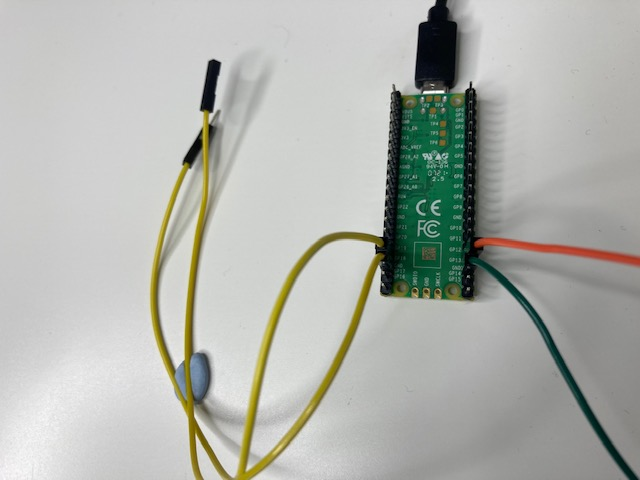

## Add a switch

It's useful to be able to control when your LED firefly starts blinking and to be able to turn it off. 

Image, gif or video showing what they will achieve by the end of the step. {:width="300px"}

The Raspberry Pi Pico can detect when an input is connected between GND and one of the GP pins.

A switch is a an electrical component that can be **closed** to allow electrical current to flow and **open** to prevent electrical current from flowing..

 

The simplest kind of switch is two jumper wires that can be connected together to close the switch and separated to open the switch. 

--- task ---

Find one pin-socket jumper wire and one socket-socket jumper wire - the colours do not matter. 

--- /task ---

--- task ---

Connect one jumper wire to **GP18** and the other to **GND**. It doesn't matter which jumper wire you connect to which pin. 

--- /task ---

--- task ---

--- code ---
---
language: python
filename: firefly.py
line_numbers: true
line_number_start: 1
line_highlights: 1, 9
---
from picozero import pico_led, LED, Button
from time import sleep

pico_led.on()
sleep(1)
pico_led.off()

firefly = LED(13)
switch = Button(18)

--- /code ---

--- /task ---

--- task ---
-- code ---
---
language: python
filename: firefly.py
line_numbers: true
line_number_start: 9
line_highlights: 12-19
---
switch = Button(18)

while True:
    if switch.value == True:
        firefly.on()
        sleep(0.5)
        firefly.off()
        sleep(2.3)
    else:
        firefly.off()
        sleep(0.1)
--- /code ---

--- /task ---

--- save ---