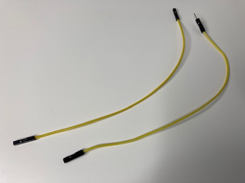
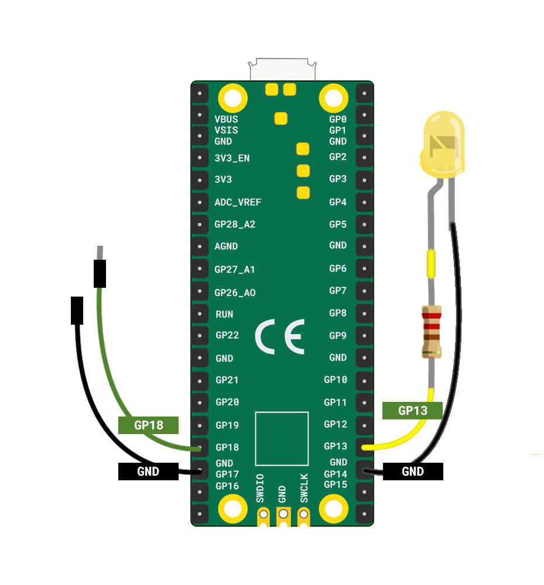
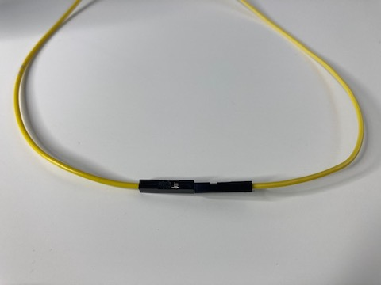
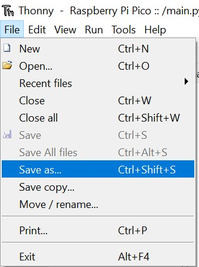
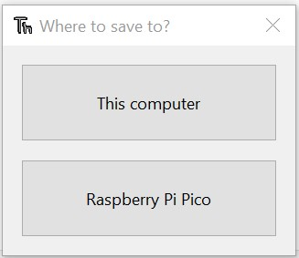
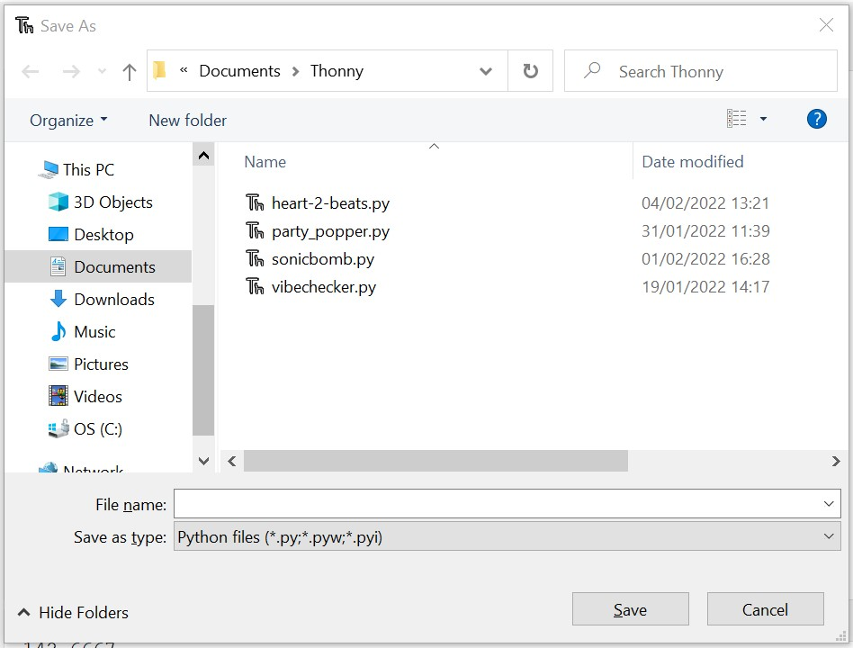

## Add a switch

It's useful to be able to control when your LED firefly starts blinking and to be able to turn it off. 

{:width="300px"}

The Raspberry Pi Pico can detect when an input is connected between GND and one of the GP pins.

A switch is a an electrical component that can be **closed** to allow electrical current to flow and **open** to prevent electrical current from flowing.

 

The simplest kind of switch is two jumper wires that can be connected together to close the switch, or separated to open the switch. 

[[[pin-socket-jumper-wires]]]

--- task ---

Find one pin-socket jumper wire and one socket-socket jumper wire - the colours do not matter. 

--- /task ---

--- task ---

Connect one jumper wire to **GP18** and the other to **GND**. It doesn't matter which jumper wire you connect to which pin. 

--- /task ---

--- task ---

To add switches, you need to `import Switch` from the picozero library. 

Add `, Switch` to the end of the import list on **line 1**. Next, set your `switch` to **GP18**:

--- code ---
---
language: python
filename: firefly.py
line_numbers: true
line_number_start: 1
line_highlights: 1, 9
---
from picozero import pico_led, LED, Switch
from time import sleep

pico_led.on()
sleep(1)
pico_led.off()

firefly = LED(13)
switch = Switch(18)

--- /code ---

--- /task ---

When you connect the two jumper wires together this completes a circuit and allows the Raspberry Pi Pico to detect that the switch is closed. You can use `is_closed` on your `switch` to check if the switch is closed (the jumpers are connected).

--- task ---

Now add code to check if your switch `is_closed` (connected) and only blink the firefly if it is closed:

--- code ---
---
language: python
filename: firefly.py
line_numbers: true
line_number_start: 9
line_highlights: 12-19
---
switch = Switch(18)

while True:
    if switch.is_closed:
        firefly.on()
        sleep(0.5)
        firefly.off()
        sleep(2.5)
    else:
        firefly.off()
        sleep(0.1)
--- /code ---

--- /task ---

--- task ---

**Test:** Make sure the jumper wires are **not** connected. Run your code.

--- collapse ---

---
title: What do you expect to happen when you run your code?
---

The jumper wires are **not** closed so the code in the `else` block will run. This means the firefly LED will stay **off**.

--- /collapse ---

Now connect the jumper wires together. 

Now the firefly should start to blink.

Disconnect the jumper wires and the firefly should stop blinking. 

--- /task ---

**Note:** Disconnecting the jumper wires will not stop power to the firefly LED immediately. The firefly only turns off when the `firefly.off()` code runs. 

--- task ---

Save your code to your computer, to make sure you have a backup in case you lose your Pico.

--- collapse ---
---
title: Saving your program locally
---

In the Thonny window, click on the `File` menu and choose `Save As`.

A small window will pop up with two buttons labeled `This Computer` and `Rasbperry Pi Pico`: 

**Choose** `This Computer`. 

In the window that appears, navigate to your chosen folder. 

**Type** in a filename and click `Save`.

--- /collapse ---

**Note:** Any changes you make to your code from now will need to be **saved to the Raspberry Pi Pico** to have an effect when run.

--- /task ---

--- task ---
**Optional:** If you are in a group then you could try synchronising your fireflies by connecting your jumper wire switches at the same time. 
--- /task ---

--- save ---