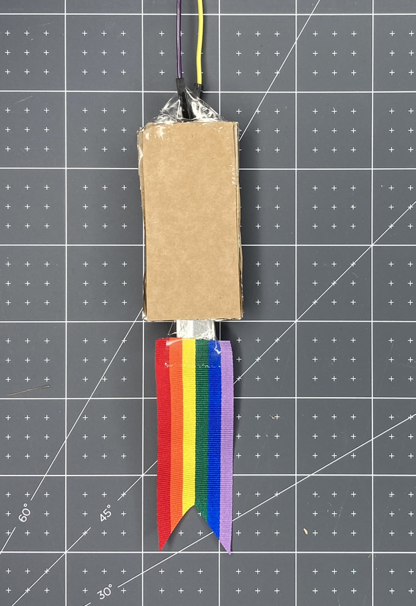
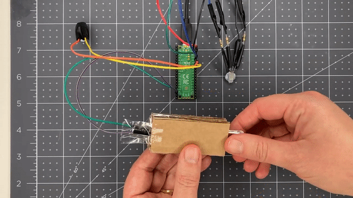

## What next?

If you are following the [Introduction to the Raspberry Pi Pico](https://projects.raspberrypi.org/en/pathways/pico-intro) path, you can move on to the [Party popper](https://projects.raspberrypi.org/en/projects/party-popper) project. In this project, you will make a reusable party popper that rewards you with a light and sound display when it is pulled.

--- print-only ---

--- /print-only ---

--- no-print ---

--- /no-print ---
