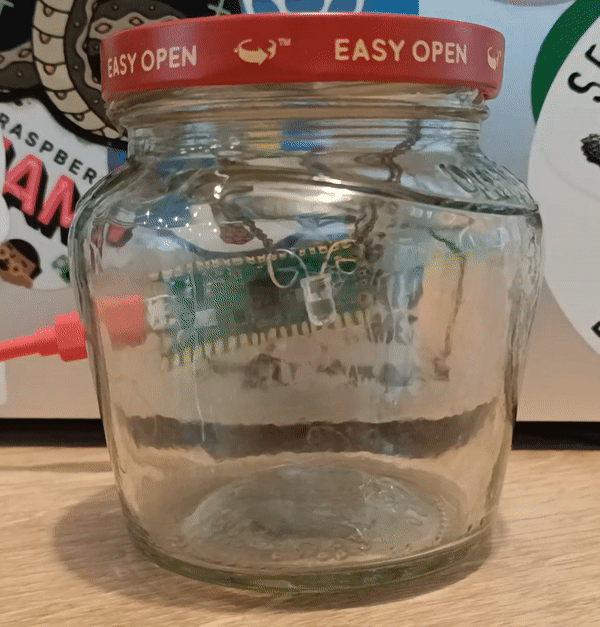

## Améliorer ton projet

Si tu as le temps, améliore ton projet Luciole. Tu peux utiliser ton projet comme décoration d'intérieur pour te rappeler la nature lorsque tu es à l'intérieur. 

{:width="300px"}

Être dans la nature est un excellent moyen d'augmenter les sentiments positifs et d'être bénéfique pour ta santé. Lorsqu'il n'est pas possible de sortir à l'extérieur, tu peux trouver des moyens d'amener la nature à toi ; par exemple, en gardant une plante d'intérieur ou en simulant ta propre luciole !

--- task ---

Tu peux améliorer ton projet en :
+ Ajoutant une autre luciole LED et la faire clignoter selon le même motif.
+ Changeant le motif de clignotement - tu peux rechercher les motifs de clignotement des lucioles dans la nature.
+ Mettant ta luciole LED dans un bocal. Tu peux même utiliser du fil pour accrocher une LED au couvercle.

--- /task ---

Les appareils embarqués contiennent souvent un microcontrôleur et sont conçus pour une tâche spécifique. Tu en as peut-être utilisé un dans une manette de jeu, un four à micro-ondes, une lumière d'ambiance, un jeu ou un jouet électronique, un podomètre, un assistant domestique à commande vocale, un appareil médical ou une calculatrice électronique. Peux-tu penser aux appareils embarqués que tu utilises ?

--- collapse ---
---
title: Le projet terminé
---

Tu peux voir le [projet terminé ici](https://rpf.io/p/en/led-firefly-get){:target="_blank"}.

--- /collapse ---
