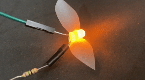

## Inleiding

In dit project gebruik je een Raspberry Pi Pico om een LED-vuurvlieg te maken die in een bepaald patroon knippert, net zoals vuurvliegen in de natuur, en sluit je een schakelaar aan om het licht te besturen.

[[[flashing-light-warning]]]

Een microcontroller is een klein computerapparaat dat code kan uitvoeren en kan communiceren met  elektronische onderdelen (zoals knoppen en lampjes). Het is meestal ontworpen om een enkele taak te voltooien en heeft geen besturingssysteem. 
De Raspberry Pi Pico is een goedkope microcontroller die door beginners kan worden gebruikt en ook door experts kan worden gebruikt om elektronische producten te ontwikkelen.

{:width="300px"}

 
Je gaat:

+ Kennismaken met de Raspberry Pi Pico **microcontroller**
+ Een LED en een schakelaar van jumper draden aansluiten op de pinnen op een **Raspberry Pi Pico**
+ De Raspberry Pi Pico programmeren met **MicroPython** en Thonny

--- no-print ---

--- task ---

In dit voorbeeld knippert een LED om een echte vuurvlieg na te bootsen! Kun je het herhalende patroon in de flitsen zien?

{:width="300px"}

--- /task ---

--- /no-print ---

--- print-only ---

--- task ---

Dit voorbeeld toont een LED-vuurvlieg. Je LED knippert om een echte vuurvlieg na te bootsen!

--- /task ---

--- /print-only ---

Om dit project te voltooien heb je het volgende nodig:

**Hardware**

Je kunt alle benodigde hardware voor dit project en de andere projecten in dit pad kopen in de [Pimoroni webstore.](https://shop.pimoroni.com/products/pico-intro-kit?variant=39893512945747){:target='_blank'}

+ Een Raspberry Pi Pico met daarop gesoldeerde pinkoppen
+ Een **data** USB A naar micro USB-kabel
+ 1× gele LED (of elke gewenste kleur)
+ 1× 100Ω (ohm) weerstand (elke weerstand van 75Ω tot 220Ω werkt)
+ 1× jumper draad met pin-bus aansluiting
+ 3 x bus-bus jumperdraden
+ Optioneel: Plakband, onzichtbare tape werkt het beste

[[[pin-socket-jumper-wires]]]

Je kunt [je LED](https://projects.raspberrypi.org/nl-NL/projects/introduction-to-the-pico){:target="_blank"} van tevoren voorbereiden door deze aan te sluiten op een weerstand en startdraden te bevestigen voordat je met het project begint.

**Software**

+ Thonny – dit project kan worden voltooid met de Thonny Python editor, die kan worden geïnstalleerd op een Linux-, Windows- of Mac-computer

[[[thonny-install]]]

[[[change-theme-thonny]]]

