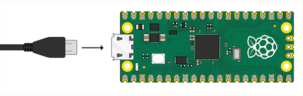

## Stel je Raspberry Pi Pico in

Sluit je Raspberry Pi Pico aan en stel MicroPython in.

MicroPython is een versie van de Python programmeertaal voor microcontrollers, zoals jouw Raspberry Pi Pico. Met MicroPython kun je je Python-kennis gebruiken om code te schrijven voor interactie met elektronische componenten.

--- task ---

**Sluit** het kleine uiteinde van je USB-kabel aan op de Raspberry Pi Pico.

--- /task ---

--- task ---

**Verbind** het andere uiteinde met je computer, laptop of Raspberry Pi.

--- /task ---

--- task ---

Open de Thonny editor.

--- /task ---

--- task ---

Kijk naar de tekst in de rechterbenedenhoek van de Thonny editor. Het zal je de versie van Python laten zien die wordt gebruikt.

Als er niet "MicroPython (Raspberry Pi Pico)" staat, klik dan op de tekst en selecteer "MicroPython (Raspberry Pi Pico)".

Als je MicroPython nog nooit op je Raspberry Pi Pico hebt gebruikt, vraagt Thonny je om de MicroPython-firmware toe te voegen. Click **Install MicroPython**.

--- /task ---

--- task ---

**Fouten oplossen:**

--- collapse ---
---
title: Er is een fout opgetreden bij het installeren van de firmware
---

Als je een foutmelding ziet tijdens de installatie:
+ Koppel je Raspberry Pi Pico los
+ Sluit je Raspberry Pi Pico opnieuw aan
+ Probeer de firmware opnieuw te installeren (mogelijk moet je eerst op de stopknop drukken)

--- /collapse ---

--- collapse ---
---
title: Ik weet niet of de firmware is geïnstalleerd en ik kan geen verbinding kan maken met mijn Pico
---

Zorg ervoor dat de Raspberry Pi Pico met een micro-USB-kabel op de computer is aangesloten. Klik op de lijst in de rechterbenedenhoek van het Thonny-venster. Er verschijnt een pop-upmenu met de beschikbare interpreters.

Als je de Pico niet in de lijst ziet (zoals in de afbeelding), moet je de Raspberry Pi Pico opnieuw verbinden terwijl je de BOOTSEL-knop ingedrukt houdt om het als een opslagvolume te koppelen en de firmware opnieuw installeren door de instructies in het bovenstaande gedeelte te volgen.

--- /collapse ---

--- collapse ---
---
title: Firmware is geïnstalleerd, maar ik kan nog steeds geen verbinding maken met mijn Pico
---

Mogelijk gebruik je de verkeerde micro-USB-kabel. De huidige micro-USB-kabel is mogelijk beschadigd of alleen ontworpen om stroom naar apparaten over te brengen en kan geen gegevens overbrengen. Probeer de kabel te verwisselen als niets anders heeft gewerkt.

Als je Pico nog steeds geen verbinding kan maken nadat je al deze dingen hebt geprobeerd, kan het **zelf** beschadigd zijn en geen verbinding kunnen maken.

--- /collapse ---

Meer informatie vind je in de [Raspberry Pi Pico Guide](https://projects.raspberrypi.org/en/projects/introduction-to-the-pico){:target="_blank"}.

--- /task ---

`picozero` is een MicroPython-bibliotheek voor beginners van de Raspberry Pi Pico.

--- task ---

Om de projecten in dit pad te voltooien, moet je de `picozero` bibliotheek installeren als een Thonny-pakket.

Kies in Thonny **Extra** > **pakketten beheren**.

--- /task ---

--- task ---

Typ `picozero` in het pop-upvenster 'beheerpakketten voor Raspberry Pi Pico' en klik op **Zoeken op PyPi**.

--- /task ---

--- task ---

Klik op **picozero** in de zoekresultaten.

Klik op **Installeren**.

Wanneer de installatie is voltooid, sluit je het pakketvenster, sluit je Thonny en dan open je Thonny opnieuw.

--- /task ---

Als je problemen hebt met het installeren van de `picozero` bibliotheek in Thonny, kun je het bibliotheekbestand downloaden en opslaan in je Raspberry Pi Pico.

[[[picozero-offline-install]]]
