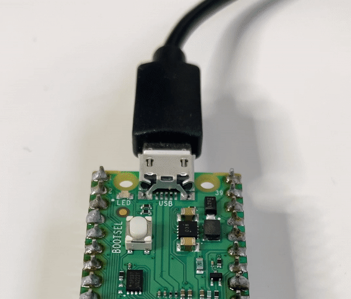

## Steek de Raspberry Pi Pico LED aan

In deze stap laat je de kleine LED branden die boven op je Raspberry Pi Pico zit. Hiermee controleer je of de Raspberry Pi Pico correct is ingesteld.

{:width="300px"}

LED staat voor lichtgevende diode. Het maakt gebruik van elektroluminescentie, waarbij een materiaal oplicht wanneer er een elektrische stroom doorheen gaat. Een LED heeft twee poten - een lange en een korte - en moet op de juiste manier worden aangesloten. De lange poot is positief (+) en de korte is de negatieve (-). Een andere manier om te controleren of een poot positief of negatief is, is door met je vinger de platte kant van de LED-lamp te vinden. De platte kant bevindt zich aan dezelfde kant als de negatieve poot.

--- task ---

Kijk naar je Raspberry Pi Pico en zoek de kleine LED naast de USB-aansluiting.

{:width="200px"}

--- /task ---

--- task ---

Maak een nieuw bestand in Thonny door op **Bestand** > **Nieuw** in de bovenste menubalk te klikken. Er wordt een lege werkruimte geopend.

--- /task ---

In de laatste stap installeerde je de `picozero` bibliotheek. In deze bibliotheek kun je elektronische onderdelen programmeren die zijn aangesloten op een Raspberry Pi Pico. Bovenaan je code moet je de items importeren die je nodig hebt uit de `picozero` bibliotheek.

--- task ---

Typ de volgende code in het hoofdvenster van de editor in Thonny:

--- code ---
---
language: python
filename: 
line_numbers: true
line_number_start: 
line_highlights: 
---
from picozero import pico_led 

pico_led.on()

--- /code ---

--- /task ---

--- task ---

Kies **Bestand**->**Opslaan als**. Thonny vraagt of je het bestand wilt opslaan op **deze computer** of op de **Raspberry Pi Pico**. Kies **deze computer** om de code op de computer op te slaan.

Kies een locatie op de computer, zoals de map 'Documenten'. Geef je bestand de naam `firefly.py`.

--- /task ---

--- task ---

**Test:** Thonny heeft een groene afspeelknop met een kleine witte driehoek erin. Door op deze knop te drukken kun je je code uitvoeren.

+ Druk op de afspeelknop

+ Controleer of de kleine LED op de Raspberry Pi Pico gaat branden

{:width="300px"}

--- /task ---

--- task ---

**Fouten oplossen:**

--- collapse ---
---
title: De afspeelknop is vervaagd (ik kan er niet op klikken)
---

Als je geen groene afspeelknop ziet (deze is vervaagd):
+ Klik op de rode **STOP** knop
+ Controleer of de Raspberry Pi Pico met een USB-kabel op de computer is aangesloten
+ Klik op **MicroPython (Raspberry Pi Pico)** in de rechterbenedenhoek van Thonny om opnieuw verbinding te maken
+ Koppel de USB-kabel los en sluit deze vervolgens weer aan

--- /collapse ---

--- collapse ---
---
title: Thonny zegt dat er een fout is in mijn code
---

Controleer je code zeer zorgvuldig en zorg ervoor dat deze overeenkomt met het voorbeeld.

--- /collapse ---

--- collapse ---
---
title: Er zijn geen fouten in mijn code, maar het lampje gaat niet branden
---

Probeer een andere USB-kabel en zorg ervoor dat het een **data** USB-kabel is. Als laatste redmiddel probeer je een andere Raspberry Pi Pico (als je er nog een hebt).

--- /collapse ---

--- /task ---

De LED blijft branden totdat je code schrijft om het uit te schakelen of totdat je de Raspberry Pi Pico loskoppelt.

--- task ---

Importeer `sleep` om je code mee te kunnen pauzeren. Voeg code toe aan het einde van je script om het een seconde te laten slapen en schakel vervolgens de LED uit.

--- code ---
---
language: python
filename: firefly.py
line_numbers: true
line_number_start: 1
line_highlights: 2,5-6
---
from picozero import pico_led
from time import sleep

pico_led.on()
sleep(1)
pico_led.off()
--- /code ---

--- /task ---

--- task ---

**Test:** Klik op de groene **afspeel** knop. Thonny zal het bestand opslaan op je Raspberry Pi Pico en vervolgens de nieuwe code uitvoeren.

Controleer of de LED gaat branden en vervolgens weer uit gaat. De LED zal slechts één seconde branden, dus zorg ervoor dat je kijkt.

Voer je code zo vaak uit als je wilt.

{:width="300px"}

**Fouten oplossen:**

--- collapse ---
---
title: Thonny zegt dat 'sleep' niet gedefinieerd is
---

Voeg de regel `from time import sleep` toe.

--- /collapse ---

--- /task ---
