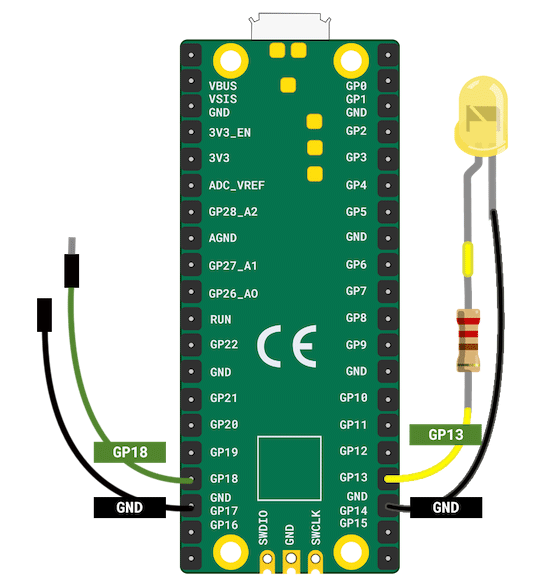
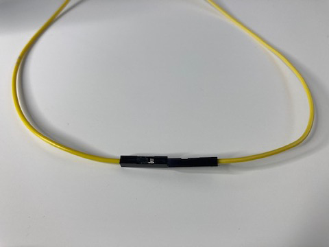

## Voeg een schakelaar toe

Het is handig om te kunnen bepalen wanneer de LED-vuurvlieg begint te knipperen en om deze uit te kunnen schakelen vanaf het apparaat. 

{:width="300px"}

De Raspberry Pi Pico kan detecteren wanneer een ingang is aangesloten tussen **GND** en een van de GP-pinnen.

Een schakelaar is een elektrische component die **gesloten** kan worden om elektrische stroom te laten stromen en **geopend** om te voorkomen dat elektrische stroom stroomt. Een knop is ook een soort schakelaar die een verbinding maakt wanneer deze **wordt ingedrukt**.

De eenvoudigste soort schakelaar bestaat uit twee jumperdraden die met elkaar kunnen worden verbonden om de schakelaar te sluiten, of gescheiden om de schakelaar te openen.

[[[pin-socket-jumper-wires]]]

--- task ---

Zoek een jumperdraad met een pin-bus en een bus-bus jumperdraad - de kleuren doen er niet toe.

--- /task ---

--- task ---

**Sluit een jumperdraad aan** op **GP18** en de andere op **GND**. Het maakt niet uit welke jumperdraad je verbindt met welke pin.

--- /task ---

--- task ---

Om schakelaars toe te voegen, moet je `import Switch` uit de `picozero` bibliotheek importeren.

Voeg `, Switch` toe aan het einde van de importlijst op **regel 1**. Zet vervolgens de `schakelaar` op **GP18**:

--- code ---
---
language: python
filename: firefly.py
line_numbers: true
line_number_start: 1
line_highlights: 1, 9
---
from picozero import pico_led, LED, Switch
from time import sleep

pico_led.on()
sleep(1)
pico_led.off()

vuurvlieg = LED(13) # Gebruik GP13
schakelaar = Switch(18) # Gebruik GP18

--- /code ---

--- /task ---

Wanneer je de twee jumperdraden met elkaar verbindt, wordt een circuit voltooid en kan de Raspberry Pi Pico detecteren dat de schakelaar gesloten is.

--- task ---

Voeg code toe om te controleren `of` je schakelaar `is_closed` (de draden zijn aangesloten) en de vuurvlieg alleen knippert als deze gesloten is:

--- code ---
---
language: python
filename: firefly.py
line_numbers: true
line_number_start: 9
line_highlights: 12-19
---
schakelaar = Switch(18) # Gebruik GP18

while True:
    if schakelaar.is_closed: # Draden zijn aangesloten
        vuurvlieg.on()
        sleep(0.5) # Blijf een halve seconde aan
        vuurvlieg.off()
        sleep(2.5) # Blijf 2.5 seconden uit
    else: # Draden zijn aangesloten
        vuurvlieg.off()
        sleep(0.1) # Kleine vertraging

--- /code ---

--- /task ---

--- no-print ---

--- task ---

**Test:** Zorg ervoor dat de jumperdraden **niet** zijn aangesloten en voer vervolgens de code uit.

--- collapse ---

---
title: Wat verwacht je dat er gebeurt als je je code uitvoert?
---

De jumperdraden zijn **niet** gesloten, dus de code in het `else` blok zal worden uitgevoerd. Dit betekent dat de vuurvlieg-LED **uit** blijft.

--- /collapse ---

Verbind nu de jumperdraden met elkaar. De vuurvlieg zou moeten beginnen te knipperen.

Koppel de jumperdraden los en de vuurvlieg zou moeten stoppen met knipperen.

--- /task ---

--- /no-print ---

--- print-only ---

--- task ---

**Test:** Zorg ervoor dat de jumperdraden **niet** zijn aangesloten en voer vervolgens de code uit.

--- collapse ---

---
title: Wat verwacht je dat er zal gebeuren als je je code uitvoert?
---

De jumperdraden zijn **niet** gesloten, dus de code in het `else` blok zal worden uitgevoerd. Dit betekent dat de vuurvlieg-LED **uit** blijft.

--- /collapse ---

Verbind nu de jumperdraden met elkaar.

De vuurvlieg zou moeten beginnen te knipperen.

Koppel de jumperdraden los en de vuurvlieg zou moeten stoppen met knipperen.

--- /task ---

--- /print-only ---

**Opmerking:** het loskoppelen van de jumperdraden zal de voeding naar de vuurvlieg-LED niet onmiddellijk stoppen. De vuurvlieg wordt alleen uitgeschakeld wanneer de `vuurvlieg.off()` code wordt uitgevoerd.

--- task ---

**Optioneel:** als je in een groep zit, kun je proberen je vuurvliegjes te synchroniseren door de schakelaars van de jumperdraden tegelijkertijd aan te sluiten.

--- /task ---
